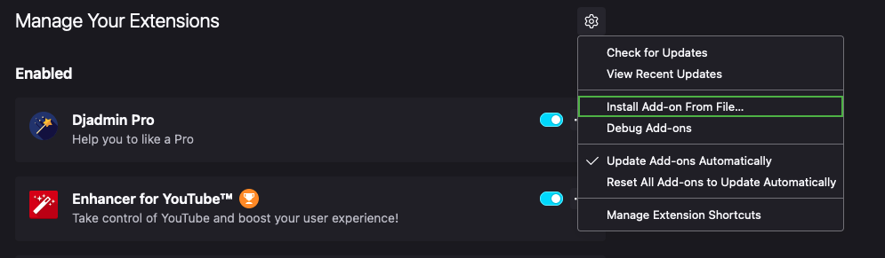
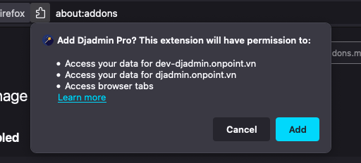
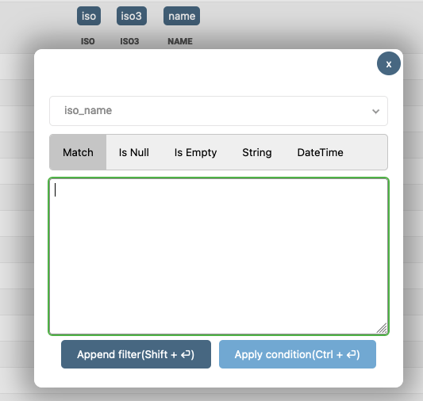
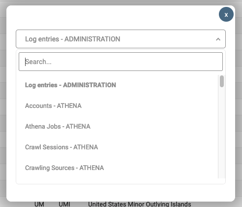

# Add some magic to Django

An Awesome extension that help quering with django faster and easier

## I. Features

- UI for building query
- Quick search and open table
- Support hotkey
- Support both Chrome and Firefox

## II. Install
Download extension
### [Download](https://github.com/quangvo09/djadmin-pro/releases)

### For Chrome ("Load unpacked extension")
1. Download and unpack the source code from the latest release or git-clone the master branch of this repository into a local folder
2. Navigate to chrome://extensions
3. Enable developer mode
4. Click on "Load unpacked extension" and select folder


### Firefox
- Open `Addons and Themes` and Install from file



- Select Extension file

- Click `Add` when asked




## III. Usage

### 1. Filter with UI

- Click on column name or press `Ctrl + j` to open the dialog and search for column name




After input the value you can

+ Press `Ctrl + Enter` to apply current filter
+ Press `Shift + Enter` to append current filter to existing filters


### 2. Search table easier

Press `Ctrl + Shift + j` to open search table dialog




Search table name and then

+ `Enter` to open selected table
+ `Ctrl + Enter`/`Cmd + Enter` to open selected table in a new tab


## IV. Query with SQL like syntax

### Usage

- Press `Ctrl + k` to show pop up
- Press `Enter` to execute command

```shell
# open table  
from octosells.users

# query with conditions
from octosells.users where is_activated = true

# set alias
alias octosells as os
alias octosells.users as osu

# query with alias
from osu where name like %bluzky%

# query with relationship
from os.users where role.code = admin
```

### Support operators
`=`, `>`, `>=`, `<`, `<=`, `like`, `ilike`, `in`, `is null`, `is not null`
